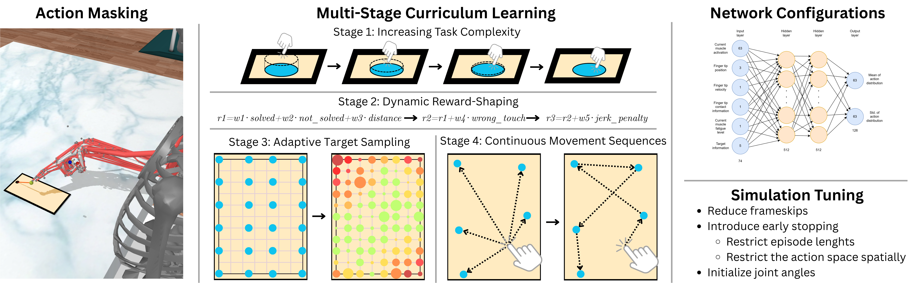

# 🚀 Increasing Interaction Fidelity: Training Routines for Biomechanical Models in HCI

<hr></hr> This project provides practical training routines for biomechanical forward simulation, enabling the generation of human-like movements in interactive tasks such as touchscreen pointing. 
Training biomechanical models with reinforcement learning is challenging, especially for precise and dexterous movements required in mobile device interactions. Existing methods often limit interaction fidelity and model complexity.
Our approach introduces curriculum learning, action masking, advanced network configurations, and targeted simulation adjustments to reduce training time, improve interaction fidelity, and support more complex biomechanical models.

## ✨Features
- Customizable MuJoCo XML model for simulating smartphone touch interactions.
- Multi-stage curriculum learning with dynamic environment difficulty adjustment.
- Action masking for efficient exploration and training.

## 📁Directory Structure
- `train_PHONE.py` — Main script for training the RL agent.
- `visualize_dexterous.py` — Visualization and analysis of trained models.
- `envs/scene/phone_dexterous.xml` — MuJoCo XML model for the touch scenario.
- `envs/dexterous_env.py` — Custom Gym environment for dexterous touch tasks.
- `policies/PPO/` — Directory containing PPO policy implementations.
- `custom_callback.py` — Curriculum learning callback for training.
- `requirements.txt` — List of required Python packages.


## ⚙️Requirements
- Conda environment with the following packages:
  - Python 3.8 or higher
  - MuJoCo
  - MyoSuite
  - Gymnasium
  - Stable Baselines3
  - Other dependencies listed in `requirements.txt`
  
To set up the environment, run:
```bash
conda create --name myenv --file requirements.txt
```

## 🏋️ Training
This script trains a dexterous RL agent using Stable Baselines3 PPO on a custom MuJoCo environment.
To start or modify training routines, edit this file directly.  
Configuration options include curriculum settings, network architecture, environment parameters, and callbacks.
To start training, run the following command in your terminal:
```bash
python train_PHONE.py
```
## 👀Visualization

To visualize the behavior of a trained policy, use the provided script:

```bash
python visualize_dexterous.py --policy_path policies/PPO/512_512/512_512_curriculum
```

## 🧑‍💻About
This library is developed and maintained by [CIAO](https://github.com/ciao-group).

If you use this codebase in your research, please cite our paper:

```bibtex
@misc{miazga_increasing_2025,
	title = {Increasing {Interaction} {Fidelity}: {Training} {Routines} for {Biomechanical} {Models} in {HCI}},
	shorttitle = {Increasing {Interaction} {Fidelity}},
	url = {http://arxiv.org/abs/2508.16581},
	doi = {10.1145/3746058.3758385},
	author = {Miazga, Michał Patryk and Ebel, Patrick},
	month = aug,
	year = {2025},
	note = {arXiv:2508.16581 [cs]},
	keywords = {Computer Science - Human-Computer Interaction, Computer Science - Machine Learning},
	
}
